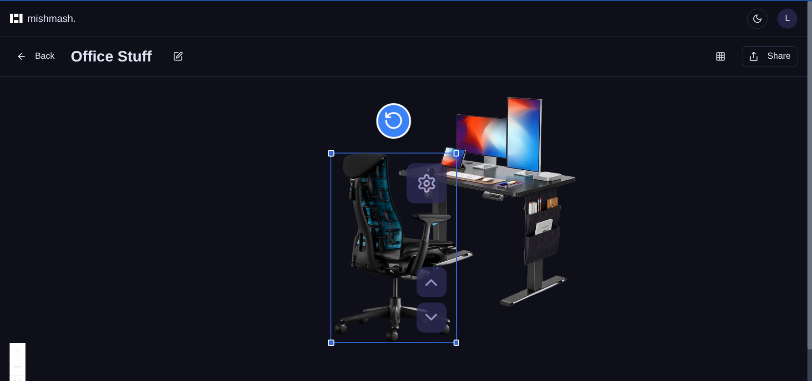

# Mishmash

A modern React-based collage creation and image editing application with AI-powered background removal. Built with Convex for real-time data management and React Flow for interactive canvas manipulation.

https://github.com/user-attachments/assets/1ce455c3-7382-4d2b-928e-41514e1de38f

## 🚀 Current Features

### 🎨 Interactive Collage Creation
- **Visual Canvas**: Create and edit collages using React Flow with drag-and-drop positioning
- **Image Management**: Upload, organize, and manipulate images within collages
- **Real-time Synchronization**: Live updates powered by Convex real-time database
- **Layer Management**: Control image layering with z-index ordering and context menus
- **Canvas Controls**: Drag, zoom, pan, and select images with visual feedback

### 🖼️ Advanced Image Editing
- **AI Background Removal**: Remove backgrounds from images using Transformers.js
- **Multiple AI Models**: Support for RMBG-1.4 (cross-browser) and MODNet (WebGPU)
- **Image Effects**: Apply blur, brightness, and contrast adjustments
- **Background Replacement**: Replace removed backgrounds with solid colors or custom images
- **Before/After Comparison**: Interactive slider to compare original and processed images

### 📁 Collage Management
- **Full CRUD Operations**: Create, read, update, and delete collages
- **Search & Filter**: Find collages by name, tags, or creation date
- **Tagging System**: Organize collages with custom tags
- **Privacy Controls**: Create private or public collages
- **Auto-save**: Changes are automatically saved as you work

### 🤝 Sharing & Collaboration
- **Share Collages**: Generate shareable links for public viewing
- **Email Sharing**: Send collages directly to recipients via email
- **Export Options**: Export collages as high-quality images (PNG format)
- **Share Management**: View, revoke, and manage all shared collages
- **Public Viewer**: Clean, read-only interface for shared collages

### 🔐 Authentication & Security
- **Email Authentication**: Secure email/password authentication
- **User-specific Data**: Each user has private collage and image management
- **Secure Sharing**: Obfuscated share IDs for public links
- **Session Management**: Persistent authentication across sessions

## 🛠️ Tech Stack

- **Frontend**: React 19, TypeScript, Vite
- **Backend**: Convex (real-time database and serverless functions)
- **Canvas**: React Flow (@xyflow/react) for interactive collage editing
- **AI Processing**: Hugging Face Transformers.js for background removal
- **UI Components**: Radix UI, shadcn/ui
- **Styling**: Tailwind CSS 3
- **Routing**: Generouted with TanStack Router
- **Package Manager**: Bun
- **File Storage**: Cloudflare R2 integration
- **Email Service**: Resend for sharing notifications

## 📚 User Guide

### Getting Started

#### 1. Create Your First Collage
Start by creating a new collage from your dashboard.


#### 2. Set Up Your Collage
Give your collage a name and configure its basic settings.


### Working with Images

#### 3. Add Images to Your Collage
Drag and drop images directly onto the canvas or use the file upload interface.


#### 4. AI-Powered Background Removal
Use our built-in AI tools to remove backgrounds from your images for cleaner compositions.


#### 5. Compare Results
See the before and after effects of background removal with our comparison slider.


#### 6. Transform and Position Images
Resize, rotate, and position your images precisely on the canvas.



#### 7. Edit Image Details
Access detailed editing options through the image properties panel.


### Sharing Your Work

#### 8. Share Your Collage
Generate shareable links and send your collages via email to collaborators or clients.


#### 9. Successful Sharing
Receive confirmation when your collage has been successfully shared.


#### 10. Public Viewing Experience
Recipients can view your shared collages in a clean, optimized interface.


#### 11. Interactive Annotations
Shared collages include interactive annotations for detailed exploration.


#### 12. Detailed Item Information
View comprehensive details about individual items in shared collages.


### Management Features

#### 13. Email Notifications
Automatic email notifications are sent to recipients when collages are shared.


#### 14. Collage Library with Previews
Your collage library displays beautiful previews of all your creations.


### Quick Tips
- **Auto-save**: All changes are automatically saved in real-time
- **Keyboard Shortcuts**: Use Delete key to remove selected images
- **Context Menus**: Right-click images for quick layer controls
- **Responsive Design**: Works seamlessly on desktop and mobile devices

## 🏗️ Architecture

### Database Schema
The app uses three main tables in Convex:

- **`collages`**: Collage metadata including name, description, tags, and image references
- **`images`**: Individual images with positioning, metadata, and collage relationships
- **`sharedCollages`**: Shared collage records with public URLs and access control

### Component Structure
```
src/
├── auth/
│   └── components/
│       ├── collages/         # Main collage canvas and editing components
│       │   ├── Canvas.tsx    # React Flow canvas implementation
│       │   ├── ImageNode.tsx # Custom image nodes for the canvas
│       │   └── hooks/        # Canvas logic and state management
│       └── bg-remove/        # AI background removal functionality
├── components/
│   ├── ui/                   # Reusable UI components (shadcn/ui)
│   ├── auth/                 # Authentication components
│   └── collages/             # Collage management components
├── pages/
│   ├── collages.tsx         # Collage list and management
│   ├── collage.[id].tsx     # Individual collage editor
│   ├── shares.tsx           # Share management dashboard
│   ├── shared.[shareId].tsx # Public collage viewer
│   └── index.tsx            # Landing page
└── convex/                  # Backend functions and schema
```

### Key Technical Features

#### Real-time Data Synchronization
- Automatic synchronization of collage changes across sessions
- Live updates when images are added, moved, or modified
- Optimistic updates with conflict resolution

#### Client-side AI Processing
- Background removal using Transformers.js (no server uploads required)
- Multiple model support with automatic fallbacks
- WebGPU acceleration when available
- iOS-optimized processing

#### Advanced Canvas Interactions
- Drag-and-drop image positioning with pixel-perfect placement
- Layer management with visual feedback
- Context menus for quick actions
- Automatic saving with debounced updates

#### Secure File Storage
- Cloudflare R2 integration for scalable image storage
- Secure upload and retrieval with signed URLs
- Automatic cleanup of unused assets

## 🎨 Current Pages & Features

### `/` - Landing Page
Simple landing page with navigation to main features

### `/collages` - Collage Management
- Grid view of all user collages
- Search and filter functionality
- Create, edit, and delete operations
- Tag-based organization

### `/collage/[id]` - Collage Editor
- Full React Flow canvas for editing
- Image upload and positioning
- AI background removal tools
- Real-time auto-save
- Share functionality

### `/shares` - Share Management
- View all shared collages
- Revoke or regenerate share links
- Bulk operations for share management
- Email recipient tracking

### `/shared/[shareId]` - Public Viewer
- Clean, read-only interface for shared collages
- No authentication required
- Optimized for viewing shared content

### `/login` & Authentication
- Email/password authentication
- Secure session management

## 🧪 Development

### Available Scripts
- `bun run dev` - Start development server on port 3000
- `bun run build` - Build for production
- `bun run type-check` - Run TypeScript type checking

### Code Quality
- TypeScript for comprehensive type safety
- ESLint for code linting and best practices
- Prettier for consistent code formatting
- Modular component architecture


---

Built with ❤️ for creative professionals and collage enthusiasts. 
